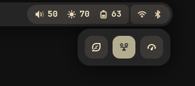

# Minos

A minimal AGS-based desktop shell for [Niri](https://github.com/YaLTeR/niri) on Wayland.

Minos is a **personal** shell/bar built with [AGS](https://github.com/Aylur/ags), GTK4, and Astal. It provides a compact top bar, workspace controls, system indicators, and small quick-settings menus intended for a Niri-based NixOS desktop.

> [!NOTE]
> This is a personal shell and is currently tailored to my setup. You may need to adjust constants in `config.ts`, runtime services, battery ID, styling, or widget behavior for your machine.

## Showcase

### Bar


### Quick settings




### Desktop overview


## Features

- GTK4/AGS shell for Wayland
- Niri workspace switcher and focused-window display
- System status widgets for:
  - battery
  - Bluetooth
  - brightness
  - volume
  - Wi-Fi
- Quick menus for:
  - brightness and night light
  - power profiles
  - volume and audio devices
- Nix flake package
- Home Manager module with a systemd user service

## Requirements

Minos is designed for a NixOS/Home Manager desktop using:

- Niri
- AGS/Astal
- GTK4
- PipeWire/WirePlumber
- NetworkManager
- Bluetooth, if using the Bluetooth widget
- `power-profiles-daemon`, if using the power profile menu
- `brightnessctl`, if direct backlight writes are not permitted
- `wl-gammarelay-rs`, if using the night-light integration

Some widgets call system tools such as `niri msg`, `brightnessctl`, and `busctl`, so the corresponding services and commands must be available in your session.

## Installation

### As a Home Manager module

Add Minos as an input to your NixOS or Home Manager flake:

```nix
{
  inputs = {
    nixpkgs.url = "github:nixos/nixpkgs/nixos-unstable";

    minos = {
      url = "github:tangerineArc/minos";
      inputs.nixpkgs.follows = "nixpkgs";
    };
  };
}
```

Then import the Home Manager module and enable the service:

```nix
{
  inputs,
  ...
}: {
  home-manager.users.your-user = {
    imports = [
      inputs.minos.homeManagerModules.default
    ];

    services.minos.enable = true;
  };
}
```

If you use standalone Home Manager:

```nix
{
  inputs,
  ...
}: {
  imports = [
    inputs.minos.homeManagerModules.default
  ];

  services.minos.enable = true;
}
```

The module installs the package and creates a `minos.service` systemd user service that starts with `graphical-session.target`.

### As a package only

If you only want the package and prefer to manage startup yourself:

```nix
{
  inputs,
  pkgs,
  ...
}: {
  home.packages = [
    inputs.minos.packages.${pkgs.stdenv.hostPlatform.system}.default
  ];
}
```

Then run:

```sh
minos
```

### Run directly from the flake

```sh
nix run github:tangerineArc/minos
```

### Build locally

Clone the repository and build the package:

```sh
git clone https://github.com/tangerineArc/minos.git
cd minos
nix build
```

Run the built shell:

```sh
./result/bin/minos
```

## Development

Enter the development shell:

```sh
nix develop
```

Run the app during development:

```sh
ags run app.ts
```

Build the packaged app:

```sh
nix build
```

## Configuration

A few values are currently hard-coded for my setup and can be adjusted in `config.ts`, including:

- bar width and height
- menu dimensions and margins
- battery device ID

For example, if your battery is exposed as `BAT0` instead of `BAT1`, update `BAT_ID` in `config.ts`.
