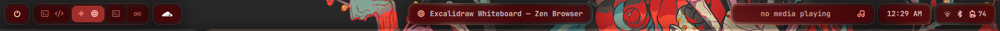
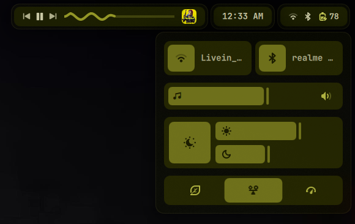
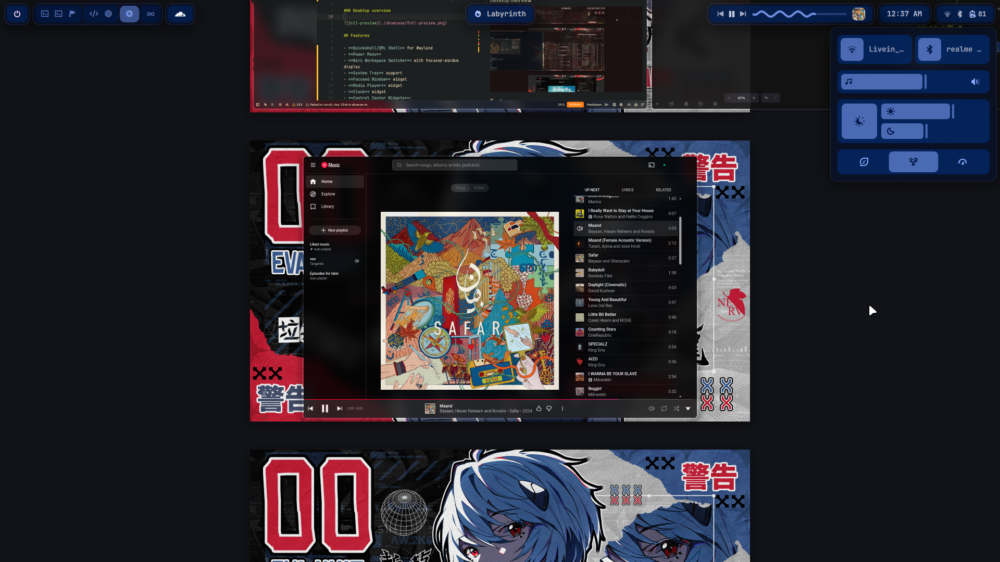

# Minos

Minos is a **personal** shell/bar built with [Quickshell](https://git.outfoxxed.me/outfoxxed/quickshell) and QML.

> [!NOTE]
> This is a personal shell and is currently tailored to my setup. You may need to adjust runtime services, styling, or widget behavior for your machine.

## Showcase

### Bar



### Control Center



### Desktop overview



## Features

- **Quickshell/QML Shell** for Wayland
- **Power Menu**
- **Niri Workspace Switcher** with focused-window display
- **System Tray** support
- **Focused Window** widget
- **Media Player** widget
- **Clock** widget
- **Control Center Widgets**:
  - Wifi and Bluetooth Toggles
  - Volume Control
  - Brightness and Nightlight Controls
  - Power Profiles
- **Dynamic Theming**: Automatic color generation integrated via Matugen

## Requirements

Minos is designed for a NixOS/Home Manager desktop using:
- Niri
- PipeWire/WirePlumber
- NetworkManager
- `brightnessctl`
- `wl-gammarelay-rs` (for night-light)
- `power-profiles-daemon`

Some widgets interact with system tools like `niri msg`, `nmcli`, `powerprofilesctl`, and `busctl`. Ensure these are available in your session.

## Installation

### As a Home Manager module

Add Minos as an input to your NixOS or Home Manager flake:

```nix
{
  inputs = {
    nixpkgs.url = "github:nixos/nixpkgs/nixos-unstable";

    minos = {
      url = "github:tangerineArc/minos";
      inputs.nixpkgs.follows = "nixpkgs";
    };
  };
}

```

Then import the Home Manager module:

```nix
{
  inputs,
  ...
}: {
  home-manager.users.your-user = {
    imports = [
      inputs.minos.homeManagerModules.default
    ];

    services.minos.enable = true;
  };
}

```

The module installs the package and creates a `minos.service` systemd user service that starts with `graphical-session.target`.

### Run directly from the flake

```sh
nix run github:tangerineArc/minos

```

## Development

Enter the development shell:

```sh
nix develop

```

Run the application during development:

```sh
quickshell -p shell.qml

```

## Configuration

Minos uses `Theme.qml` to handle styling and color tokens, which dynamically react to a `colors.json` file generated at `~/.local/state/quickshell/generated/colors.json`.
